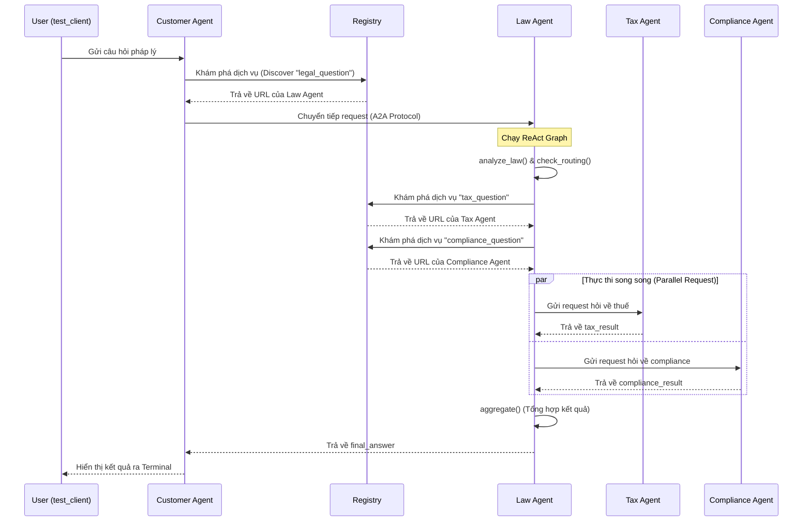

# Giải thích Code Stage 5 (Distributed A2A System)

Stage 5 đưa toàn bộ kiến trúc đa tác nhân (Multi-Agent) từ việc chạy chung một file (như Stage 4) sang chạy dưới dạng **microservices độc lập** (phân tán). Mỗi Agent là một dịch vụ lắng nghe trên một cổng (port) riêng biệt và giao tiếp với nhau bằng giao thức A2A (Agent-to-Agent Protocol).

---

### 1. Phân bổ các Services
Hệ thống gồm 5 dịch vụ chính:
- **Registry (Port 10000):** Đóng vai trò như danh bạ (Service Discovery). Các Agent khác khi khởi động sẽ phải đăng ký với Registry để cho biết nó giải quyết task nào (ví dụ: `tax_question`).
- **Customer Agent (Port 10100):** Cổng giao tiếp với người dùng. Nhận câu hỏi, tìm Agent phù hợp để ủy quyền (thường là Law Agent).
- **Law Agent (Port 10101):** Agent điều phối chính (Luật sư trưởng). Phân tích câu hỏi và gọi các chuyên gia cấp dưới.
- **Tax Agent (Port 10102):** Chuyên gia về thuế.
- **Compliance Agent (Port 10103):** Chuyên gia về tuân thủ luật lệ và quy định.

---

### 2. Quan sát logs và `trace_id`
Thông qua hệ thống logs, ta có thể theo dõi một request bằng mã `trace_id` (ví dụ: `trace=e678155b-cf7b-4de1-87e4-e6cf6f935797`). 
`trace_id` được sinh ra ở Customer Agent và truyền xuyên suốt qua tất cả các agent. Điều này giúp theo dõi vòng đời của một tin nhắn, từ lúc được gửi vào hệ thống (depth 0) tới khi nhảy qua Law Agent (depth 1), rồi xuống Tax & Compliance Agent (depth 2).

---

### 3. Sequence Diagram (Sơ đồ trình tự Request Flow)
Dưới đây là luồng đi của một câu hỏi qua các services, được minh hoạ bằng Mermaid:

---

### 4. Dynamic Discovery và Khả năng chịu lỗi
Trong quá trình test, khi ta chủ động **Stop (dừng) Tax Agent**, Law Agent vẫn hỏi Registry để lấy địa chỉ Tax Agent. Việc Tax Agent bị ngắt kết nối đã chứng minh tính linh hoạt của cấu trúc phân tán: nếu một Agent sập, nó chỉ làm mất chức năng của nhánh đó chứ không làm toàn bộ hệ thống monolithic bị sập ngay lập tức (giống như Stage 4). Law Agent có thể xử lý lỗi và tiếp tục đưa ra câu trả lời dựa trên những kết quả nó thu thập được từ các Agent còn sống.

---

### 5. Tuỳ chỉnh Prompt của Agent
Thông qua việc chỉnh sửa file `tax_agent/graph.py`, tôi đã rút gọn `TAX_SYSTEM_PROMPT` và yêu cầu agent trả lời ngắn gọn (under 3 sentences). 
Nhờ tính chất độc lập, ta chỉ cần **khởi động lại riêng rẽ dịch vụ Tax Agent** (trên cổng 10102) mà không cần khởi động lại Law Agent hay Customer Agent. Các request tiếp theo sẽ lập tức được Tax Agent xử lý bằng luật (prompt) mới, cho ra câu trả lời thuế ngắn gọn và hiệu quả hơn hẳn.
